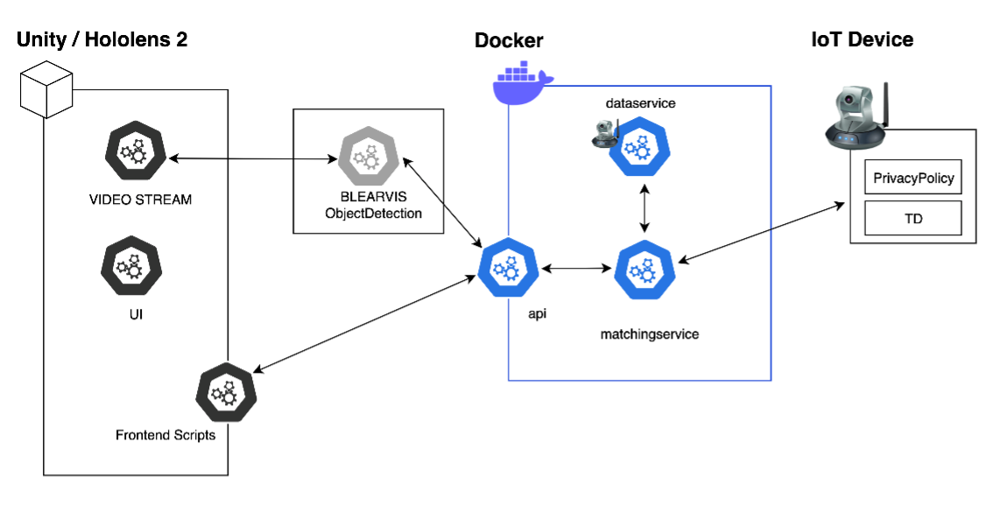

# Exercising the Right to Privacy for IoT Device Interactions in Mixed Reality

This project enables secure interaction and management of IoT devices, such as cameras and smart lamps. It includes features for device discovery, executing device-specific actions (like turning off cameras or controlling brightness), and ensuring privacy compliance with robust authentication mechanisms. This project is containerized with Docker for consistent deployments and ease of scaling.

---

## Table of Contents
- [Overview](#overview)
- [Installation](#installation)
- [Usage](#usage)
- [API Endpoints](#api-endpoints)
- [Environment Variables](#environment-variables)
- [Docker Configuration](#docker-configuration)
- [Directory Structure](#directory-structure)
- [Example Request](#example-request)

---

## Overview

This project integrates Mixed Reality (using Unity, MRTK3 and HoloLens 2) with IoT privacy management. It uses advanced features like BLEARVIS for object detection and privacy policy matching to enhance user interaction while ensuring compliance with privacy standards.


Key components:
- **Unity/HoloLens 2**: Provides the Mixed Reality interface, which is based on Mixed Reality Toolkit 3(MRTK3), including video streams
- **BLEARVIS ObjectDetection**: Layers video stream with object detection and sends api call to `api` service running on docker
- **Dockerized Backend**: Handles data services, API communication, and matching services.
- **IoT Devices**: Interfaces with IoT devices, provides Thing Descriptions (TD), and privacy policies.

---

## Installation

### Prerequisites
- Docker and Docker Compose installed
- Unity development environment for Mixed Reality applications
- Running ObjectDetection on the HoloLens Stream e.g. [BLEARVIS objectDetection](https://github.com/Interactions-HSG/blearvis/tree/6e593207e55966f082aa631da37da4d58aeadcb3/code/HoloLens/BLEARVIS-Desktop-ObjectDetection)
- Access to IoT devices with compatible Thing Descriptions and Privacy Policies

### Steps
1. Clone the repository:
   ```bash
   git clone https://github.com/Interactions-HSG/2024-IMP-RightToPrivacyInMR.git
   cd 2024-IMP-RightToPrivacyInMR
   ```

2. Build and start the Docker containers:
   ```bash
   docker-compose up --build
   ```

3. Launch the Unity project in your HoloLens 2 environment:
    - Open the `MixedRealityProject` folder in Unity.
    - Deploy the app to HoloLens 2.

4. Run BLEARVIS ObjectDetection with a trained model which detects the IoT devices:
    - Use model in `/appendix/model/best_hue_hik.onnx` for detection of (Huelamp, HIKvision)
    - Configure endpoint of api call after detection
      ```yaml
      HOLO_ENDPOINT: True
      HOLO_ENDPOINT_URL: 'http://<your-server-ip>:8082/api/analyze-device'
      ```
5. Start detecting IoT devices with Hololens 2 :)

## Usage

1. **Device Discovery**:
    - Use the UI in the HoloLens app to scan and discover nearby IoT devices.

2. **Device Control**:
    - Select a device from the Mixed Reality interface.
    - Execute actions (e.g., turning off a camera or adjusting brightness).

3. **Privacy Compliance**:
    - The backend ensures compliance by retrieving and analyzing the privacy policy of each IoT device before executing any action.

---

## API Endpoints

### Base URL
`http://<your-server-ip>:<port>/api`

### Endpoints
- **GET /devices**
    - Retrieves a list of discovered IoT devices.
    - **Response**:
      ```json
      [
        {
          "name": "Camera 1",
          "type": "camera",
          "status": "online"
        },
        ...
      ]
      ```

- **POST /action**
    - Executes a specific action on an IoT device.
    - **Request**:
      ```json
      {
        "deviceId": "12345",
        "action": "turnOff"
      }
      ```

- **GET /privacy-policy/{deviceId}**
    - Retrieves the privacy policy for a specific device.
    - **Response**:
      ```json
      {
        "policy": "This device collects video and audio data..."
      }
      ```

---

## Environment Variables

The application does not require any environment variables.

---

## Docker Configuration

### Docker Compose File
The `docker-compose.yml` file defines the services:
- `dataservice`: Simulates IoT device with providing TD / privacy policies
- `matchingservice`: Matches Thing Descriptions (TD) with privacy policies and stores it locally.
- `api`: Exposes RESTful endpoints for the Unity app.

### Commands
- Build and start containers:
  ```bash
  docker-compose up --build
  ```
- Stop containers:
  ```bash
  docker-compose down
  ```

---

## Directory Structure

```
/project-root
├── /archive                # Project Related Data
├── /docker                 # Docker-related configuration
│   ├── Dockerfile
│   └── docker-compose.yml
├── /api/                    # Backend API service
├── /dataservice/            # Simulates IoT device with providing TD / privacy policies
├── /matchingservice/        # Policy matching logic
├── /Unity/                  # Unity project files
└── README.md
```

---

## Example Request

### Device Discovery
**Request**:
```bash
curl -X GET http://<your-server-ip>:5000/api/devices
```
**Response**:
```json
[
  {
    "name": "Smart Lamp",
    "type": "lamp",
    "status": "online"
  },
  {
    "name": "Security Camera",
    "type": "camera",
    "status": "offline"
  }
]
```

---

## Future Work
- Support for more complex device actions.
- Improved UX design for broader user preferences.
- Automated privacy policy analysis using large language models (LLMs).

---

## Contributing
Contributions are welcome! Please fork the repository and submit a pull request with your changes.

---